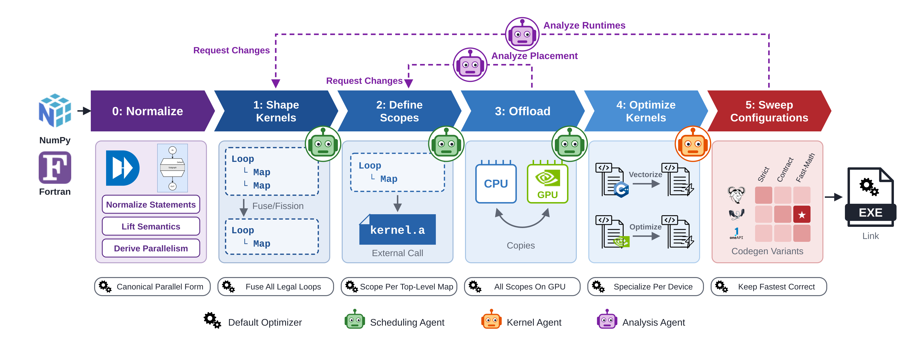

# NestForge

NestForge optimizes a whole DaCe program in phases. Each phase makes one decision, ships a
deterministic default, and exposes the same API to a scripted optimizer, a human, and an LLM agent.

[](docs/figures/pipeline.svg)

| Phase | Decides | Default optimizer | Agent |
|---|---|---|---|
| [0 Normalize](docs/phases/0-normalize.md) | canonical parallel form for the enabled targets | canonicalize up to fusion | none |
| [1 Shape Kernels](docs/phases/1-shape-kernels.md) | fusion and fission granularity | fuse all legal loops | scheduling |
| [2 Define Scopes](docs/phases/2-define-scopes.md) | which nests become external kernels | one scope per parallel top-level map | scheduling |
| [3 Offload](docs/phases/3-offload.md) | device per kernel, host/device copies | all scopes on the GPU with a GPU target | scheduling |
| [4 Optimize Kernels](docs/phases/4-optimize-kernels.md) | each kernel's code, one `lib<kernel>.a` | standalone CPF kernel: C++ on CPU, CUDA on GPU | kernel |
| [5 Sweep Configurations](docs/phases/5-sweep-configurations.md) | compiler, FP mode, vectorizer cost model | keep the fastest correct variant | none |

Phase 5 sweeps GNU, LLVM and oneAPI against three FP modes (strict, contract, fast-math) and the
vectorizer cost models, and checks every variant against the kernel's NumPy oracle.

Two analysis agents [request changes](docs/phases/feedback.md): one reads measured runtimes and
sends phase 1 back to reshape kernels, the other reads offload placements and sends phase 2 back to
redefine scopes. Agents follow [AGENTS.md](AGENTS.md).

## Quick start

```bash
python examples/quickstart.py --device cpu --out quickstart_out
python examples/quickstart.py --device gpu --out quickstart_out
```

The script runs the default optimizer on HPCAgent-Bench's `fuse_diamond` at preset S (`LEN_1D=512`):
four loops where `t = a*a` feeds `u = t + 1` and `v = t - 1`, then `out = u*v`. `--device gpu`
stops after phase 3 for now, since GPU kernels wait for CPF's CUDA form. On `fuse_diamond`:

0. Normalize: canonicalization already fuses the 4 loop nests into 1 parallel map.
1. Shape Kernels: nothing is left to fuse, so the program stays at 1 map.
2. Define Scopes: the map becomes one kernel, `extcall_0`, which reads `a` and writes `out`.
3. Offload: on CPU the kernel stays on the host; on GPU it runs on the device, `a` is copied in and `out` back.
4. Optimize Kernels: CPF renders `extcall_0` as one C++ file; g++ builds `libextcall_0.a` for the program.
5. Sweep Configurations: 15 variants; here `g++`, `contract-fma`, `no-vec` won at 2.9 us per call.

```
quickstart_out/
  0-normalize.sdfg ... 3-offload.sdfg   one program SDFG per phase (3 only with --device gpu)
  4-optimize-kernels.sdfg               the program, extcall_0 bound to libextcall_0.a
  5-sweep-configurations.json           per nest: compiler, FP mode, cost model, flags, time
  kernels/extcall_0/                    extcall_0.cpp (CPF unit) and libextcall_0.a
  program/                              the program's generated C++
  work/                                 build tree
```

## Install and test

```bash
uv sync --extra dev                                              # dace @ extended, hpcagent-bench @ main
uv run pytest -m "not integration and not gpu and not vendor"    # unit set
uv run pytest -m integration                                     # compiles and runs kernels
```

Benchmark kernels and the NumPy to C, C++ and Fortran translator come from
[HPCAgent-Bench](https://github.com/spcl/HPCAgent-Bench). HPCAgent-Bench imports NestForge, so
`import nestforge` never loads HPCAgent-Bench; only the functions that need it do.

## Layout

```
nestforge/
  session.py   the one API over all phases
  phases/      normalize, schedule, scopes, kernel, variants, feedback
  ir/          extraction, NumPy emission, the ExternalCall library node, structure views
  build/       DaCe codegen and compile, compilers on PATH, FP flags, the validate-and-time arena
  corpus/      HPCAgent-Bench kernels and the translator bridge
```

## More docs

- [Emitter contract](docs/emitter.md): how kernels become NumPy oracles and translator input.
- [Build and linking](docs/build.md): DaCe codegen, static archives, one OpenMP runtime.
- [FP modes and vectorization](docs/fp-and-vectorization.md): the three FP modes and the cost models.

## References

- Phase 0 builds on *The Canonical Parallel Form as a Substrate for Parallelizing Compilers and
  Agentic Optimizers*, which defines the canonical parallel form (CPF).
- Phase 4 agents and the kernel corpus come from *HPCAgent-Bench*.
- Phase 5 is the variant search of *The Data Must Flow (To Vector Processors): Searching Program
  Variants to Improve Compiler Auto-Vectorization Capabilities* (ICS'26).
