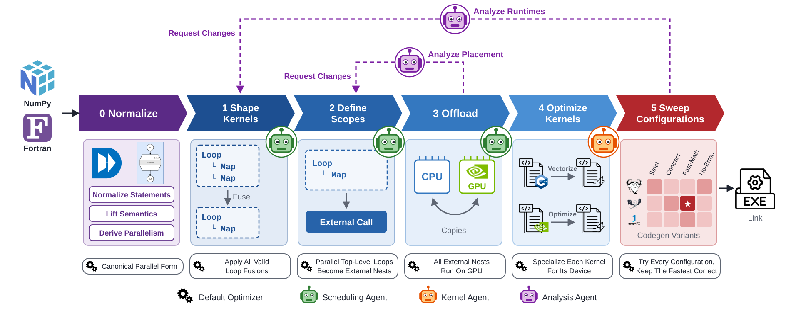

# NestForge

NestForge optimizes a whole DaCe program in phases. Each phase makes one decision, ships a
deterministic default, and exposes the same API to a scripted optimizer, a human, and an LLM agent.



| Phase | Decides | Deterministic default | Agent |
|---|---|---|---|
| [0 Normalize](docs/phases/0-normalize.md) | canonical parallel form for the enabled targets | canonicalize up to fusion | none |
| [1 Inter-kernel schedule](docs/phases/1-inter-kernel.md) | fusion and fission granularity | full fusion | scheduling |
| [2 Scope definition](docs/phases/2-scope-def.md) | which scopes become external kernels | top-level compute nests | scheduling |
| [2.5 Offloading](docs/phases/2.5-offload.md) | device per kernel, host/device copies | DaCe GPU offloading | scheduling |
| [3 Kernel optimization](docs/phases/3-kernel-opt.md) | each kernel's implementation, one `lib<kernel>.a` | DaCe vectorizer | kernel |
| [4 Codegen variants](docs/phases/4-codegen-variants.md) | compiler, flags, FP mode, ISA per kernel | brute-force sweep | none |

Measurements flow back to phase 1 through the [feedback edges](docs/phases/feedback.md) (e) and (g),
read by an analysis agent. Agents follow [AGENTS.md](AGENTS.md).

## Install and test

```bash
uv sync --extra dev                                # dace @ extended, hpcagent-bench @ main
uv run pytest -m "not integration and not gpu"     # unit set
uv run pytest -m integration                       # compiles and runs kernels
```

Benchmark kernels come from [HPCAgent-Bench](https://github.com/spcl/HPCAgent-Bench); its
loop-level-reasoning track contains TSVC-2.

## Layout

```
nestforge/
  session.py   the one API over all phases
  phases/      normalize, schedule, scopes, offload, kernel, variants, feedback
  ir/          extraction, numpy emission, the ExternalCall library node, structure views
  build/       owned DaCe build, toolchains, flags, the compile-validate-time arena
  corpus/      HPCAgent-Bench kernels and the numpy translator
```

## References

- Phase 0 builds on *The Canonical Parallel Form as a Substrate for Parallelizing Compilers and
  Agentic Optimizers* (the MPR paper), which defines CPF.
- Phase 3 agents and the kernel corpus come from *HPCAgent-Bench*.
- Phase 4 is the variant search of *The Data Must Flow (To Vector Processors): Searching Program
  Variants to Improve Compiler Auto-Vectorization Capabilities* (ICS'26).
